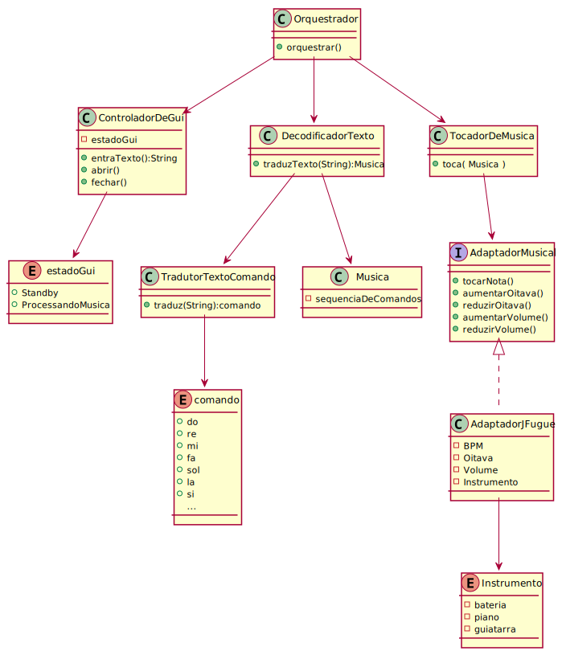
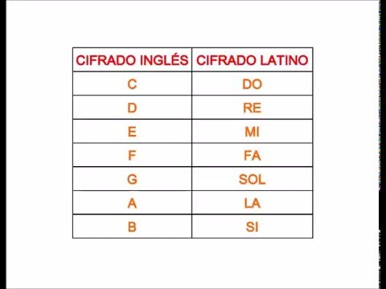
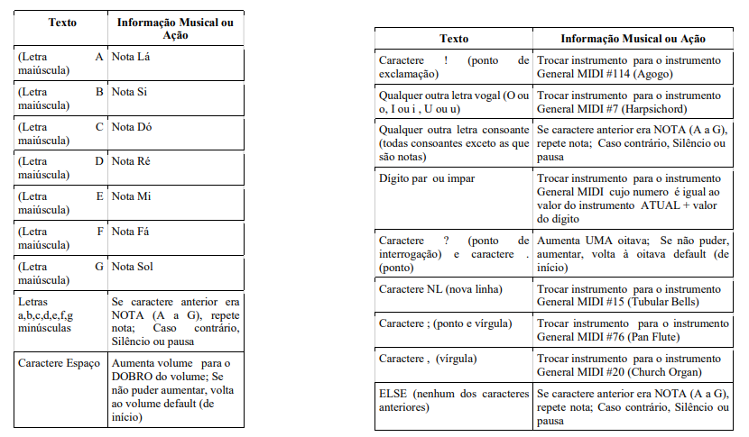

# TCP

Repositorio para o desenvolvimento do projeto prático para a disciplina de Técnicas de Construção de Programa do 4º semestre do curso de Ciencia da Computação - UFRGS.

## Requisitos

+ Ter uma interface que permita ao usuario entrar um texto
+ Permitir ao usuario definir um arquivo como entrada de texto alternativa
+ Tocar sons de acordo com a entrada do usuario
+ Permitir ao usuario fazer o download da musica criada pelo software
+ Permitir ao usuario controlar volume, BPM e oitava
+ Permitir ao usuario selecionar o instrumento
+ Reproduzir uma serie de sons de acordo com a entrada do usuario

## Rodar

O arquivo .jar está disponivel na pasta target. Para build manual, utilizar `mvn clean install` para gerar .jar localmente.

## Diagrama de Classes

## Croqui Telas

## Auxiliar

## Lista de Comandos

